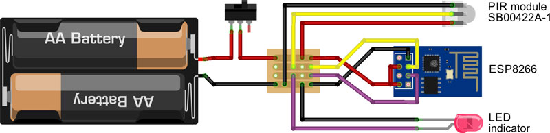
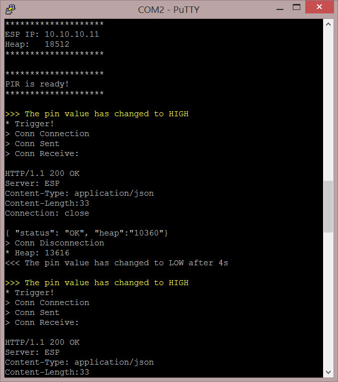

# ESP8266-trap

Use a PIR coupled with ESP8266 to trigger a remote camera.  

This is a companion project for my [ESP8266 remote camera trigger](https://github.com/CosmicMac/ESP8266-remote).  
It uses a PIR sensor to detect movement and a ESP82266 (client) to send trigger command to another ESP (server) coupled with the camera.  

PIR sensor is a [SB00422A-1](http://en.nysenba.com/index.php/page-8-51.html) ([datasheet](readme/sb00422-datasheet.pdf)).  
I only modified the default delay time (11s on my model), setting it at the minimum value (4s on my model) by connecting the `time` pin of the sensor directly to `ground`.  
*The "delay time" is the number of seconds the PIR signal stay up after the last movement was detected.*

### Shopping list

1. ESP8266 running a recent version of NodeMCU (I used `nodemcu_integer_0.9.6-dev_20150406`)
2. battery AAA x 2
3. battery holder
4. switch
5. PIR SB00422A-1
6. LED (3V tolerant, or add appropriate resistor) 
7. cable and a small piece of prototyping board
8. enclosure (I use tablets tube, as usual :))

### Wiring

### About the LED indicator...

The LED should be `on` for a few seconds at startup, then go `off` until the next PIR movement detection.  
A blinking LED after startup means that the wifi configuration has failed (ESP was unable to connect to the server module). In this case, just check if the ESP server module coupled with the camera is activated, then switch the PIR module `off` and `on` again.  
On normal operation, the LED should stay `on` while movement is detected, and go `off` 4 seconds after movement has stopped.

### Caveats

I did not find the time to test the whole system in real condition (OK, I need to purchase some seeds for birds first ;) ) but it seems very stable, with no false trigger.

The only drawback I can see for the moment is the latency: objects moving fast will probably not be catched (but I have to confirm this point by doing real tests).  
Any idea on how to reduce latency would be greatly appreciated.

### Resources
* http://www.esp8266.com/viewtopic.php?f=13&t=1361  
  ESP8266 Community Forum (obviously...)

* http://www.esp8266-projects.com/2015/03/esp8266-pir-motion-sensor-detection.html  
  Useful informations and code, and a great site too for ESP8266 aficionados (actually, it was my starting point for this project)
  
* http://techgurka.blogspot.pt/2013/05/cheap-pyroelectric-infrared-pir-motion.html  
  In case you could no put your hand on a SB00422A-1, here is how to modify a common PIR Motion Sensor to work on 3.3v
    

&nbsp;
&nbsp;

----

*Have a nice day playing with ESP8266!*